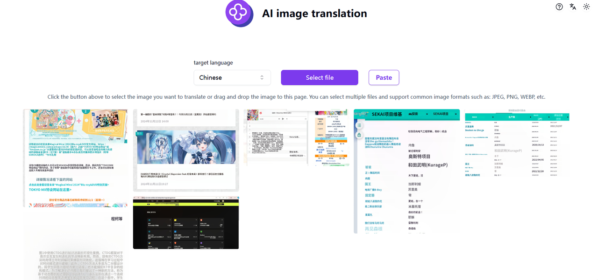

# 
💻 AI Image Translation 🚀✨

AI image translation can quickly recognize the text in images and translate it into the corresponding languages using large language models. It is suitable for use in scenarios such as document scans and comics.

<a href="README zh.md">中文</a> | <a href="README.md">English</a> | <a href="README_ja.md">日本語</a>

This is the open-source version of [AI Image Translation](https://302.ai/tools/pt/) from [302.AI](https://302.ai).
You can directly log in to 302.AI to use the online version with zero code and zero configuration.
Or modify this project according to your needs, input 302.AI's API KEY, and deploy it yourself.

## Interface Preview
AI quickly recognizes the text in pictures and translates it into the corresponding languages.

## Project Features
### 🛠️ Multi-language Conversion
Extract text from pictures and translate it into multiple languages. Whether it's comics or screenshots, multi-language conversion can be achieved quickly.
### ✍️ Intelligent Recognition
Intelligently recognize text areas and layouts to ensure accurate translation.
### 🖼️ Support for Multiple Picture Formats
- PNG
- JPG
- JPEG
- WEBP
### 📤 Batch Processing
Multiple picture files can be processed simultaneously to improve efficiency.
### 🌙 Eye-friendly Dark Mode
Provide a dark mode to take care of your eye health.
### 🌍 Multi-language Support
- Chinese Interface
- English Interface
- Japanese Interface

With AI Image Translation, any image content can be viewed normally! 🎉💻 Let's explore the new world of AI-driven code together! 🌟🚀

## 🚩 Future Update Plans 
- [ ] Optimize blurry and low-quality pictures
- [ ] Improve the compatibility in terms of different picture formats and the size limitations of picture files

## Tech Stack
- Next.js 14
- Tailwind CSS
- Shadcn UI
- Vercel AI SDK

## Development & Deployment
1. Clone project `git clone https://github.com/302ai/302_image_translation`
2. Install dependencies `pnpm install`
3. Configure 302's API KEY (refer to .env.example)
4. Run project `pnpm dev`
5. Build and deploy `docker build -t coder-generator . && docker run -p 3000:3000 coder-generator`

## ✨ About 302.AI ✨
[302.AI](https://302.ai) is a pay-as-you-go AI application platform that solves the last mile problem of AI implementation for users.
1. 🧠 Combines the latest and most comprehensive AI capabilities and brands, including but not limited to language models, image models, voice models, and video models.
2. 🚀 Deep application development on basic models - we develop real AI products, not simple chatbots
3. 💰 Zero monthly fee, all features are pay-per-use, fully open, achieving truly low barriers with high potential.
4. 🛠 Powerful management backend for teams and SMEs - one person manages, multiple people use.
5. 🔗 All AI capabilities provide API access, all tools are open source and customizable (in progress).
6. 💡 Strong development team, launching 2-3 new applications weekly, daily product updates. Developers interested in joining are welcome to contact us
