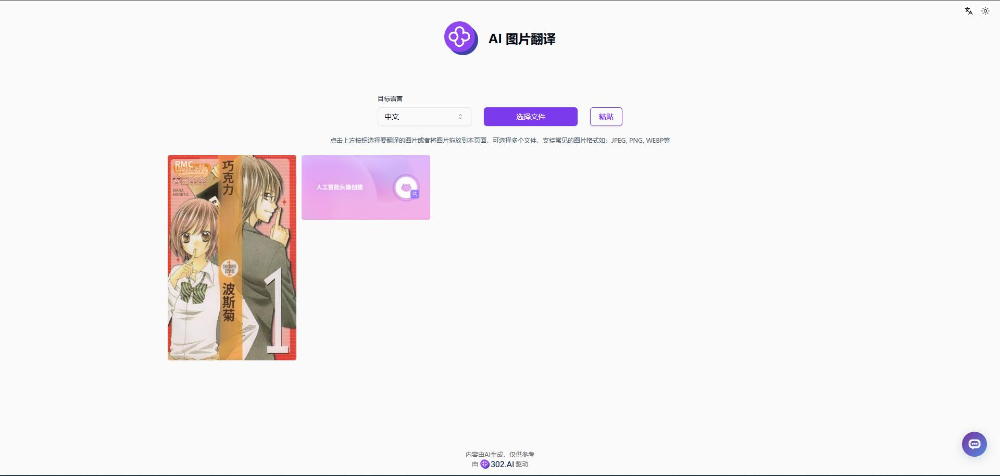

# 💻🤖 Welcome to 302.AI's AI Image Translation! 🚀✨

[Chinese](README_zh.md) | [English](README.md) | [Japanese](README_ja.md)

This is the open-source version of [AI Image Translation](https://302.ai/tools/pt/) from [302.AI](https://302.ai).
You can directly log in to 302.AI to use the online version with zero code and zero configuration.
Or modify this project according to your needs, input 302.AI's API KEY, and deploy it yourself.

## ✨ About 302.AI ✨
[302.AI](https://302.ai) is a pay-as-you-go AI application platform that solves the last mile problem of AI implementation for users.
1. 🧠 Combines the latest and most comprehensive AI capabilities and brands, including but not limited to language models, image models, voice models, and video models.
2. 🚀 Deep application development on basic models - we develop real AI products, not simple chatbots
3. 💰 Zero monthly fee, all features are pay-per-use, fully open, achieving truly low barriers with high potential.
4. 🛠 Powerful management backend for teams and SMEs - one person manages, multiple people use.
5. 🔗 All AI capabilities provide API access, all tools are open source and customizable (in progress).
6. 💡 Strong development team, launching 2-3 new applications weekly, daily product updates. Developers interested in joining are welcome to contact us

## Project Features
1. 🛠️ Extract text from images and translate into multiple languages. Whether comics or screenshots, quickly achieve multilingual conversion.
2. ✍️ Intelligent recognition of text areas and layout.
3. 🖼️ Support for multiple image formats (PNG, JPG, JPEG, WEBP)
4. 📤 Batch processing of multiple image files
5. 🌙 Dark mode: Provides dark mode to protect your eye health.
6. 🌐 Full internationalization: Support for Chinese, English, and Japanese interface switching.

With AI Image Translation, any image content can be viewed normally! 🎉💻 Let's explore the new world of AI-driven code together! 🌟🚀

## Tech Stack
- Next.js 14
- Tailwind CSS
- Shadcn UI
- Vercel AI SDK

## Development & Deployment
1. Clone project `git clone https://github.com/302ai/302_image_translation`
2. Install dependencies `pnpm install`
3. Configure 302's API KEY (refer to .env.example)
4. Run project `pnpm dev`
5. Build and deploy `docker build -t coder-generator . && docker run -p 3000:3000 coder-generator`

## Interface Preview
