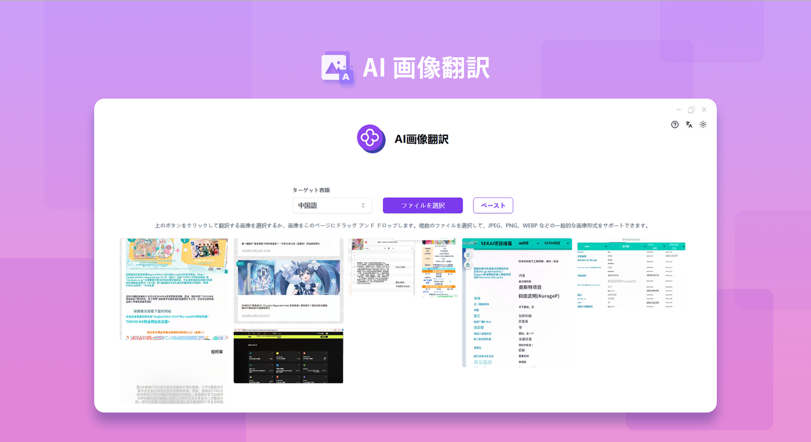
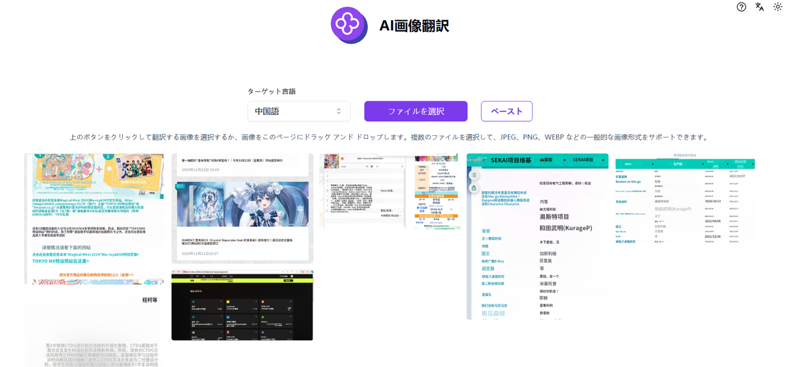

# 
💻 AI画像翻訳🚀✨

AI 画像翻訳は、画像内の文字を迅速に認識し、大規模言語モデルを利用して対応する言語に翻訳することができます。ドキュメントのスキャン画像、漫画などのシーンでの使用に適しています。

<a href="README_zh.md">中文</a> | <a href="README.md">English</a> | <a href="README_ja.md">日本語</a>

[302.AI](https://302.ai)が提供する[AI画像翻訳](https://302.ai/ja/tools/pt/)のオープンソース版です。
302.AIに直接ログインすれば、コード不要・設定不要でオンライン版をご利用いただけます。
また、このプロジェクトを自身のニーズに合わせてカスタマイズし、302.AIのAPI KEYを使用して独自にデプロイすることも可能です。

## インターフェースプレビュー
AI は画像内の文字を迅速に認識し、対応する言語に翻訳します。

## プロジェクトの特徴
### 🛠️ 多言語変換
画像から文字を抽出し、複数の言語に翻訳します。漫画であれ、スクリーンショットであれ、多言語変換を迅速に実現できます。
### ✍️ 知的認識
文字の領域とレイアウトを知的に認識し、翻訳の精度を保証します。
### 🖼️ 複数の画像形式をサポートする
- PNG
- JPG
- JPEG
- WEBP
### 📤 一括処理
複数の画像ファイルを同時に処理でき、効率を向上させます。
### 🌙 配慮のあるダークモード
ダークモードを提供し、あなたの目の健康を守ります。
### 🌍 多言語サポート
- 中国語インターフェース
- 英語インターフェース
- 日本語インターフェース

AI画像翻訳で、あらゆる画像コンテンツを快適に閲覧！🎉💻 AIが切り開く新しいコードの世界を一緒に探検しましょう！🌟🚀

## 🚩 将来のアップデート計画
- [ ] ぼやけた低品質な画像を最適化する
- [ ] 異なる画像形式や画像ファイルのサイズ制限に関する互換性を向上させる

## 技術スタック
- Next.js 14
- Tailwind CSS
- Shadcn UI
- Vercel AI SDK

## 開発・デプロイ手順
1. プロジェクトのクローン：`git clone https://github.com/302ai/302_image_translation`
2. 依存パッケージのインストール：`pnpm install`
3. 302のAPI KEY設定（.env.exampleを参照）
4. 開発サーバーの起動：`pnpm dev`
5. ビルド・デプロイ：`docker build -t coder-generator . && docker run -p 3000:3000 coder-generator`

## ✨ 302.AIの紹介 ✨
[302.AI](https://302.ai)は、従量課金制のAIアプリケーションプラットフォームで、ユーザーのAI実践における最後の1マイル問題を解決します。
1. 🧠 言語モデル、画像モデル、音声モデル、動画モデルなど、最新・最多のAI機能とブランドを統合
2. 🚀 基本モデルをベースに高度なアプリケーション開発を実施。単なるチャットボットではなく、真のAI製品を開発
3. 💰 月額料金なし、すべての機能が従量課金制。完全オープンで、参入障壁が低く、可能性は無限大
4. 🛠 チームや中小企業向けの強力な管理バックエンド。1人で管理し、複数人で利用可能
5. 🔗 すべてのAI機能にAPIアクセスを提供、全ツールがオープンソースでカスタマイズ可能（開発中）
6. 💡 週2-3個の新アプリケーションをリリースする強力な開発チーム。製品は毎日更新。開発者の参加も歓迎
