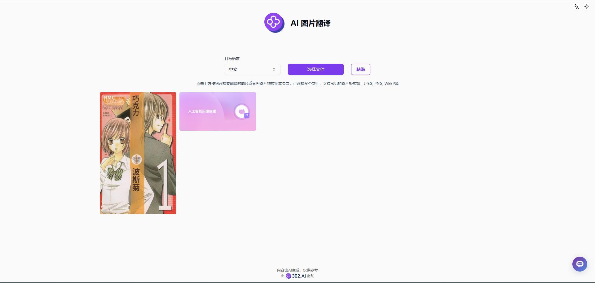

はい、以下は完全な日本語訳です：

# 💻🤖 302.AIのAI画像翻訳へようこそ！🚀✨

[中文](README_zh.md) | [English](README.md) | [日本語](README_ja.md)

[302.AI](https://302.ai)が提供する[AI画像翻訳](https://302.ai/tools/pt/)のオープンソース版です。
302.AIに直接ログインすれば、コード不要・設定不要でオンライン版をご利用いただけます。
また、このプロジェクトを自身のニーズに合わせてカスタマイズし、302.AIのAPI KEYを使用して独自にデプロイすることも可能です。

## ✨ 302.AIの紹介 ✨
[302.AI](https://302.ai)は、従量課金制のAIアプリケーションプラットフォームで、ユーザーのAI実践における最後の1マイル問題を解決します。
1. 🧠 言語モデル、画像モデル、音声モデル、動画モデルなど、最新・最多のAI機能とブランドを統合
2. 🚀 基本モデルをベースに高度なアプリケーション開発を実施。単なるチャットボットではなく、真のAI製品を開発
3. 💰 月額料金なし、すべての機能が従量課金制。完全オープンで、参入障壁が低く、可能性は無限大
4. 🛠 チームや中小企業向けの強力な管理バックエンド。1人で管理し、複数人で利用可能
5. 🔗 すべてのAI機能にAPIアクセスを提供、全ツールがオープンソースでカスタマイズ可能（開発中）
6. 💡 週2-3個の新アプリケーションをリリースする強力な開発チーム。製品は毎日更新。開発者の参加も歓迎

## プロジェクトの特徴
1. 🛠️ 画像からテキストを抽出し、多言語に翻訳。マンガやスクリーンショットなど、どんな画像も素早く多言語化
2. ✍️ テキスト領域とレイアウトのAI認識
3. 🖼️ 多様な画像フォーマットに対応（PNG, JPG, JPEG, WEBP）
4. 📤 複数画像の一括処理に対応
5. 🌙 ダークモード搭載：目に優しい表示モード
6. 🌐 多言語対応：日本語、英語、中国語のインターフェース切替

AI画像翻訳で、あらゆる画像コンテンツを快適に閲覧！🎉💻 AIが切り開く新しいコードの世界を一緒に探検しましょう！🌟🚀

## 技術スタック
- Next.js 14
- Tailwind CSS
- Shadcn UI
- Vercel AI SDK

## 開発・デプロイ手順
1. プロジェクトのクローン：`git clone https://github.com/302ai/302_image_translation`
2. 依存パッケージのインストール：`pnpm install`
3. 302のAPI KEY設定（.env.exampleを参照）
4. 開発サーバーの起動：`pnpm dev`
5. ビルド・デプロイ：`docker build -t coder-generator . && docker run -p 3000:3000 coder-generator`

## インターフェースプレビュー
